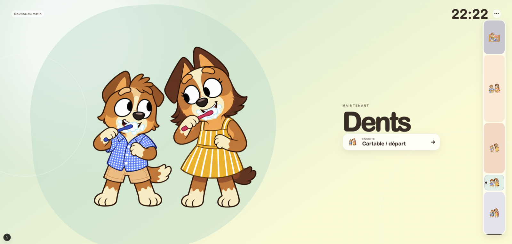

<div align="center">

# Petites Routines

### Le grand écran qui rend les petits moments plus simples.

Une application douce, lisible et très visuelle pour accompagner les routines quotidiennes des enfants.



</div>

## L'idée

Les matins et les soirs sont plus apaisés quand chacun sait ce qui se passe maintenant — et ce qui vient juste après.

Petites Routines transforme le planning familial en un écran plein format, conçu pour être compris de loin : une grande illustration, l'activité en cours, quelques repères de temps et la prochaine étape. Les enfants gagnent en autonomie, les adultes évitent de répéter sans cesse la même consigne.

## Ce que l'application fait

- Affiche automatiquement la routine active selon le jour et l'heure.
- Met en avant une seule activité à la fois, avec une illustration adaptée aux enfants.
- Représente le temps restant avec de petits jetons visuels de cinq minutes.
- Annonce clairement la prochaine étape.
- Permet aux parents de reprendre la main à tout instant : étape précédente, suivante, sélection d'une routine ou retour au mode automatique.
- Propose une page de réglages pour personnaliser activités, horaires, jours, couleurs et illustrations.
- Conserve les réglages localement dans le navigateur : aucun compte, aucune donnée envoyée à un serveur.

## Pour qui ?

Petites Routines a été imaginée pour un écran partagé à la maison et pour des enfants d'âges différents : les plus jeunes suivent les images et l'enchaînement « maintenant / ensuite », tandis que les plus grands font progressivement le lien entre l'heure, la durée et l'ordre des activités.

Les routines du matin et du soir sont prêtes à l'emploi, mais tout est modifiable pour s'adapter à votre famille.

## Démarrer en local

**Prérequis :** [Node.js 24](https://nodejs.org/) et pnpm 11.23.0 (géré par le champ `packageManager`).

```bash
pnpm install
pnpm dev
```

Ouvrez ensuite [http://localhost:3000](http://localhost:3000). Les réglages sont accessibles depuis `/settings` ou via le menu discret de l'écran principal.

## Qualité

```bash
pnpm check       # formatage, diagnostic et tests unitaires
pnpm test:e2e    # parcours navigateur
pnpm verify      # contrôle complet avant une PR
```

La CI exécute ces contrôles pour chaque pull request et chaque mise à jour de `main`.

## Architecture

```text
src/app/                    Routes et composition Next.js
src/features/routines/      Logique métier, composants et tests de la routine
public/routines/            Illustrations affichées par l'application
tests/e2e/                  Parcours Playwright
SPEC.md                     Intention produit et règles fonctionnelles
```

Le projet est construit avec Next.js, React et TypeScript. Le MVP est volontairement sans backend : `localStorage` suffit pour les préférences de la famille. La configuration Supabase présente dans le dépôt prépare une évolution éventuelle, sans identifiant ni donnée de production.

## Contribution

Les retours, idées d'accessibilité et améliorations de l'expérience enfant sont bienvenus. Avant de proposer un changement, consultez [`SPEC.md`](./SPEC.md) : c'est la référence fonctionnelle du projet. Gardez l'interface simple, lisible de loin et centrée sur une seule étape à la fois.

## Licence

Ce projet est publié sous [licence MIT](./LICENSE) : chacun peut l'utiliser, le modifier, le distribuer ou le vendre, y compris commercialement, à condition de conserver l'avis de copyright et la licence. Le logiciel est fourni sans garantie.
